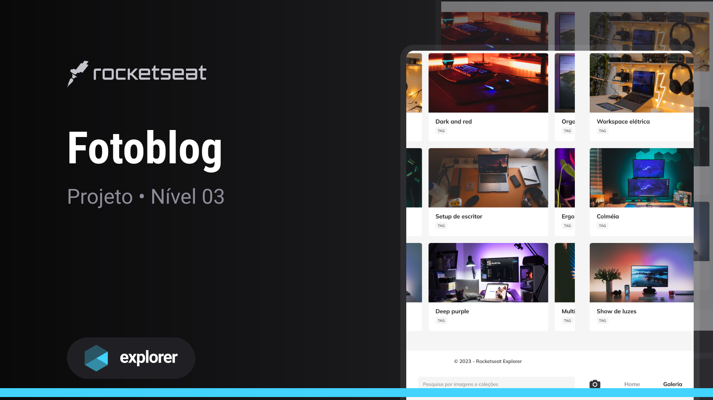

<strong> <h1 align="center"> Fotoblog </h1></strong>

## 🚀 Tecnologias

Esse projeto foi desenvolvido com as seguintes tecnologias:

- HTML
- CSS
- Git e Github

## 🏷️ Layout

Você pode visualizar o layoout do projeto através
[desse link](<https://www.figma.com/file/C1qRHElyklCs9Vr6wW9iFd/Fotoblog-%E2%80%A2-Projeto-Explorer-(Community)?type=design&node-id=0-1&mode=design&t=UIJoktcWxzDLjdp8-0>).
É necessário ter uma conta no [Figma](https://www.figma.com)